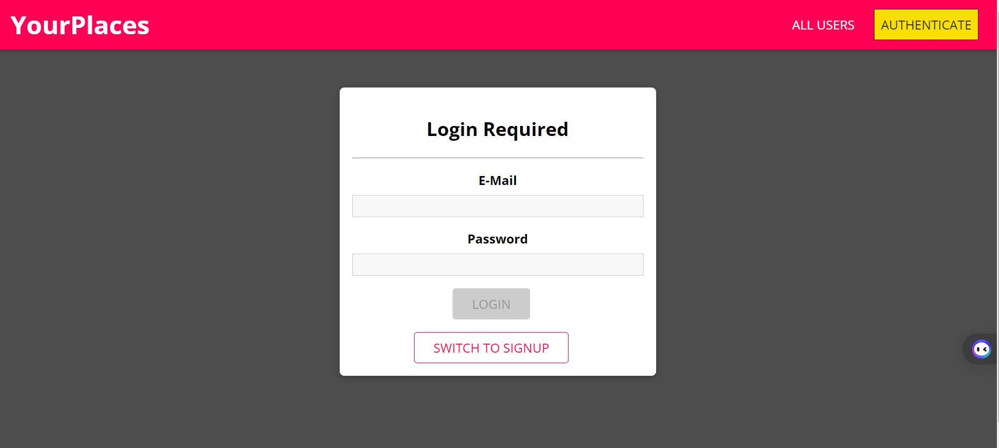

# MyPlaces - Share Your Favorite Spots!

Welcome to MyPlaces, a full-stack web application where users can sign in, log in, and share their favorite places with descriptions, addresses, and pictures.

## Table of Contents

- [Features](#features)
- [Technologies Used](#technologies-used)
- [Installation](#installation)
- [Live Demo](#live-demo)
- [Screenshots](#screenshots)
- [Contributing](#contributing)
- [License](#license)
- [Author](#author)

## Features

- **User Authentication**: Secure user authentication system allows users to sign up and log in securely.
- **Add Places**: Users can add multiple places with details like name, description, address, and a picture.
- **Edit and Delete**: Users can edit and delete the places they have added.
- **View All Places**: All users can view the list of places shared by the community.
- **Responsive Design**: The application is designed to be responsive and works seamlessly across devices of all sizes.

## Technologies Used

- **MongoDB**: Database to store user information and place details.
- **Express.js**: Backend framework for handling HTTP requests and routing.
- **React.js**: Frontend library for building user interfaces.
- **Node.js**: JavaScript runtime environment for server-side logic.
- **Mongoose**: Elegant MongoDB object modeling for Node.js.
- **JWT**: JSON Web Tokens for secure authentication.
- **Multer**: Middleware for handling multipart/form-data (used for uploading pictures).
- **Material-UI**: React components for a sleek and modern UI design.

## Installation

1. Clone the repositories:
   - Frontend: `git clone https://github.com/hafiz1379/mern-project-frontend.git`
   - Backend: `git clone https://github.com/hafiz1379/mern-project-backend.git`
2. Install dependencies:
   - Frontend: `npm install`
   - Backend: `npm install`
3. Set up environment variables:
   - Create a `.env` file in the `backend` directory.
   - Define the following variables:
     ```
     PORT=5000
     MONGODB_URI=your_mongodb_connection_string
     JWT_SECRET=your_jwt_secret
     ```
4. Start the development servers:
   - Frontend: `npm start`
   - Backend: `npm start`

## Live Demo

You can check out a live demo of the application [here](https://mern-project-frontend-ruod.onrender.com).

## Screenshots




## Backend Repository

You can find the backend repository [here](https://github.com/hafiz1379/mern-project-backend).


## Contributing

Contributions are welcome! If you'd like to contribute to this project, please fork the respective repositories and create a pull request.

## License

This project is licensed under the MIT License - see the [LICENSE](./LICENSE) file for details.

## Author

👤 **Hafizullah Rasa**

- GitHub: [Hafiz Rasa](https://github.com/hafiz1379)
- LinkedIn: [Hafiz Rasa](https://www.linkedin.com/in/hafiz1379/)

